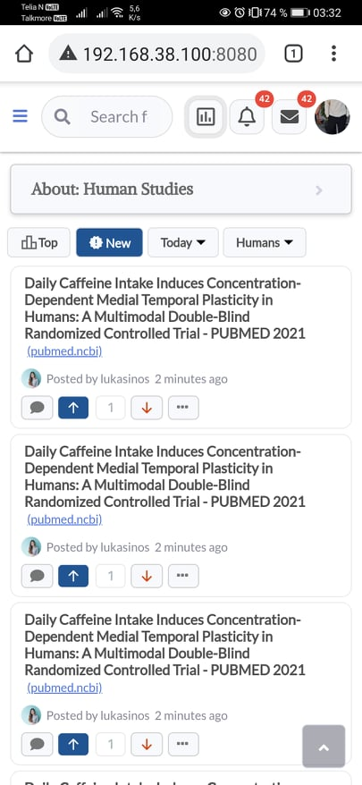
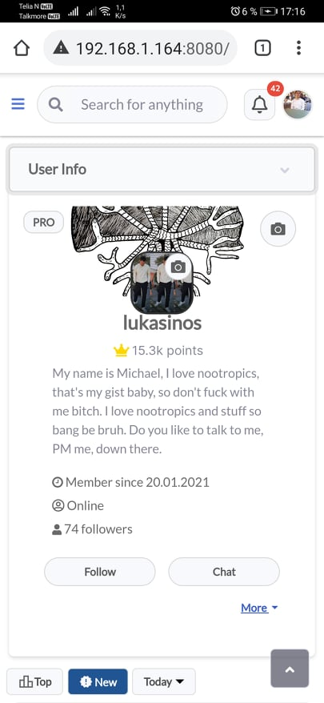
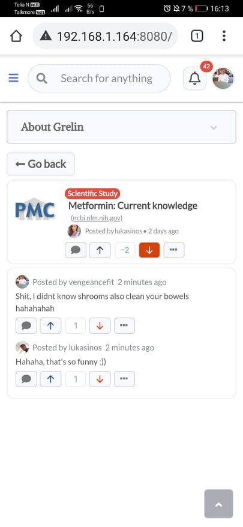

  
  <h1 align="center">Grelin</h1>
  <h3 align="center">A Community for Biohackers & Nootropic Enthusiasts</h3>

---

Grelin was a space that tried to foster discussion and dissemination of the latest scientific research relevant to the biohacker community. Although the project is not currently operational, it stands as a testament for my attempt to create such a specialized community platform.

---

## 🧬 About Grelin
Grelin is a platform that was inspired by the likes of Hackernews, crafted specifically for biohackers and nootropic enthusiasts. It's core values was objectivity, free-speech and science. This project was built using Vue 3, Firebase/Firestore, and Netlify, and it features an automated system that periodically crawls PubMed for the latest studies on nootropics and biohacking, sharing them directly to the main feed if relevant.

## 🖼️ Screenshots

  
  

  
  

 
 
---
